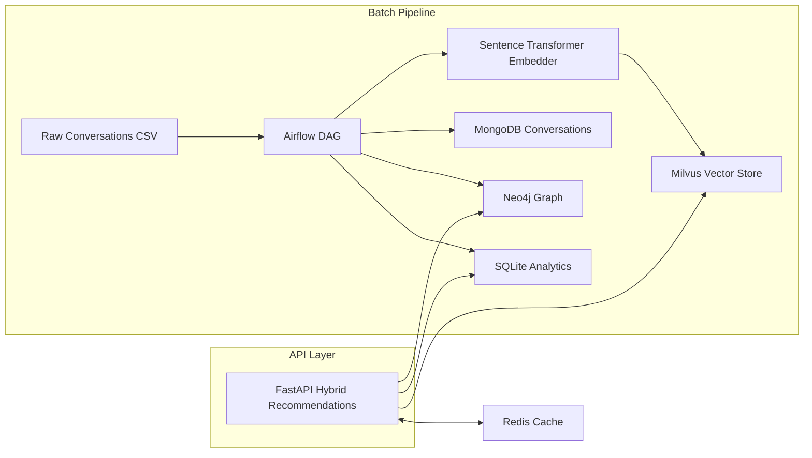

```mermaid
flowchart LR
  subgraph Batch Pipeline
    A[Raw Conversations CSV] --> B[Airflow DAG]
    B --> C[Sentence Transformer Embedder]
    C --> D[Milvus Vector Store]
    B --> E[MongoDB Conversations]
    B --> F[Neo4j Graph]
    B --> G[SQLite Analytics]
  end
  subgraph API Layer
    H[FastAPI Hybrid Recommendations]
  end
  H --> D
  H --> F
  H --> G
  H <--> I[Redis Cache]
```
